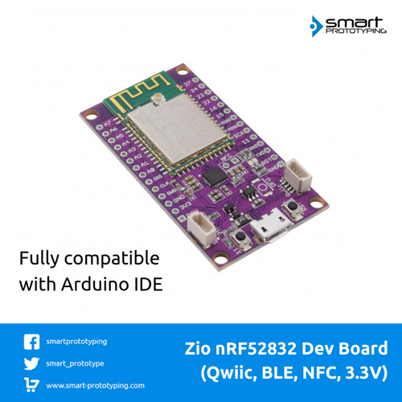

# Zio Qwiic nRF52832 Dev Board

> This product can be available for purchase [here](https://www.smart-prototyping.com/Zio-nRF52832-Dev-Board-Qwiic-NRF-BLE).

> If you're looking for the nRF52832 Bluetooth module, you can check it out [here](https://www.smart-prototyping.com/nrf52832-Bluetooth-NFC-Module)

#### Description

This nRF52832 Dev Board is based on a well designed nRF52832 BLE module (E73). We’ve flashed Adafruit’s nrf52 Arduino bootloader for you, which makes it compatible with Arduino IDE. The dev board is open source hardware, for any makers and engineers they can embed the nRF52832 module into their project once the prototype is verified. 

The board breakouts all the pins from the module, and the pins for the NRF antenna. There is one NFC antenna with the package, which can be easily soldered to the through holes. 

We also added two Qwiic connectors, so you can use our Qwiic modules to instantly start I2C projects.

For the main IC nRF52832, you can check it from Nordic official website [here](https://www.nordicsemi.com/Products/Low-power-short-range-wireless/nRF52832). 

> Note: the Pins are not pre-soldered.

#### Specification

* BLE MCU: nrf52832
* USB UART MCU: SILICON LABS CP2104
* Weight: 8.1g
* Dimension: 30.0 x 55.3mm

#### Links

* [nrf52832 Datasheet](http://infocenter.nordicsemi.com/pdf/nRF52832_PS_v1.4.pdf)
* [nrf52832 official link](https://www.nordicsemi.com/eng/Products/Bluetooth-low-energy/nRF52832)
* [nrf52832 module Schematic](https://www.smart-prototyping.com/image/data/2_components/Bluetooth/101920%20nrf52832%20Bluetooth%20Module%20(CE,%20FCC,%20Half-Cut%20Hole)/nrf52832_module_schematic.png)
* [Eagle file and source file for Dev board](https://github.com/ZIOCC/Zio-Qwiic-nRF52832-Dev-Board)
* [Schematic for Dev Board](https://github.com/ZIOCC/Zio-Qwiic-nRF52832-Dev-Board/blob/master/Zio%20Qwiic%20nRF52832%20Dev%20Board%20Schematic%20PDF.pdf)
* [Adafruit nRF52 Arduino Bootloader](https://github.com/adafruit/Adafruit_nRF52_Arduino_Bootloader)

> ###### About Zio
> Zio is a new line of open sourced, compact, and grid layout boards, fully integrated for Arduino and Qwiic ecosystem. Designed ideally for wearables, robotics, small-space limitations or other on the go projects. Check out other awesome Zio products [here](https://www.smart-prototyping.com/Zio).

